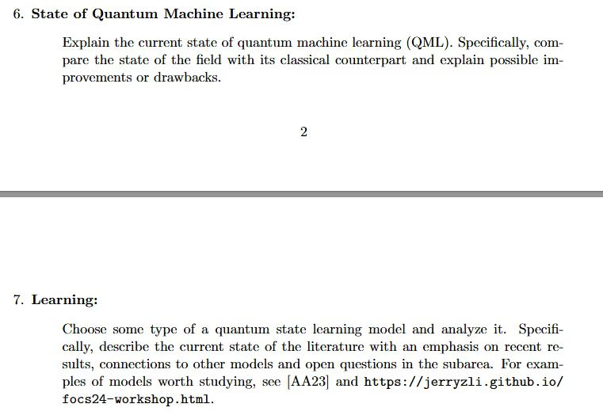

# Project 12-08

## Topic 7 Requirement

## Tentative Schedule

- 文献综述/最近(11/9 -- 11/23)
- 其他经典的状态估计方法(12/01 -- 12/07)
- 开放性问题(12/07)

## Review

用machine learning去估计状态

[quantum learning intro](https://jerryzli.github.io/focs24-workshop.html)

## State Estimation

跟课上讲的做联系，比如2其他经典估计方法跟learning比较着重做一下